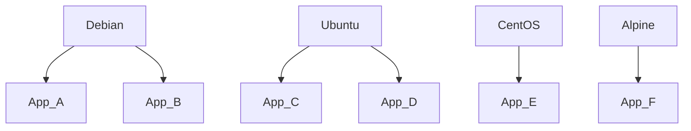
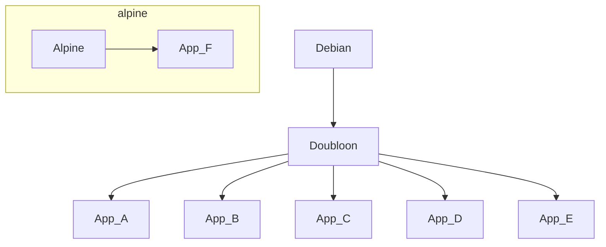

# doubloon
The makingitallwork (MIAW) base container / golden image repository

### Introduction

A base container / golden image is when you create a standard image that will be used by all your apps / services.  Doubloon will be the MIAW's base container. 

# Why use a Base Container / Golden Image?

The purpose of this pattern is to have a common standard image across all (or at least most) of your apps / services.  First let us see what things are like without a base container to better understand why a base container is useful.

Let's say we have a some apps, A, B, C, D, E and F.  App A and B both use Debian, App C and D use CentOS, App E use the CentOS container and App F use Alpine because App D requires musl.  It would look like this. 

  
Now lets say you need to add a security agent that needs to be in each app's container.  You would need to add and configure the agent in each app, test and deploy each app and then monitor each app to see if the agent every fails to install / start.

This would be a lot of work.  This is where a base container comes in handy.  What if App F specifically needs Alpine for their musl requirement but you can get the teams running App A through E to use the same container.  If all the remaining teams can use Debian for example, you can take the official Debian container, install the security agent and call this new container which we will call Doubloon.  This would look like so:

So now you can make sure Doubloon has the security agent and all your apps can be tested via their CI pipelines (CI stands for Continuous Integration).  This is much less work and now teams supporting A through E can share knowledge in situations such as if there is a difficult dependency to install.   

Let's keep both scenarios (with and without a base container) and the security agent version has major update with breaking changes.  In the scenario without the base container there is a huge amount of work across multiple teams which will in turn carry lots of risk.  In the base container scenario there is much less work.  The more standard tools you need deployed the more time you save.

This is the value of a base container